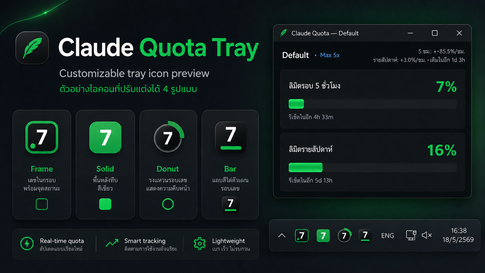
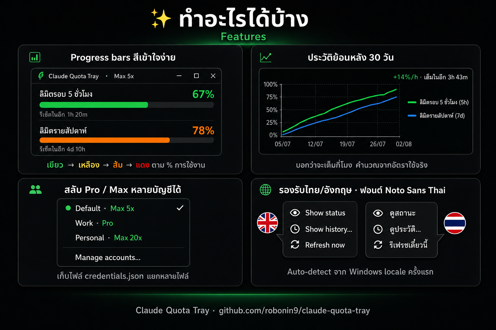
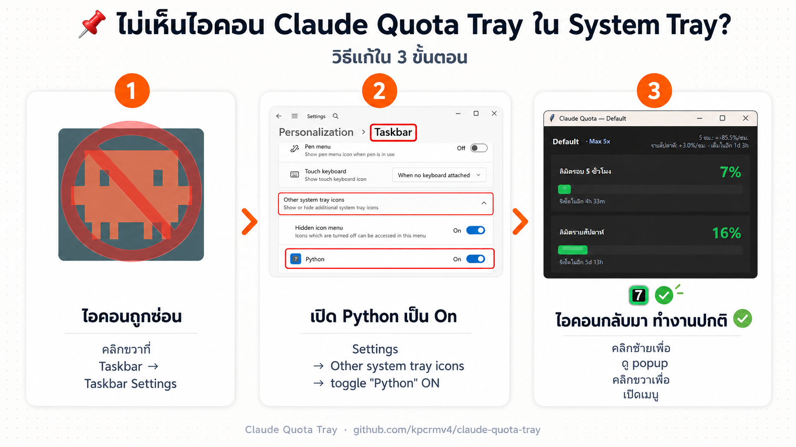

# Claude Quota Tray

ไอคอน system tray สำหรับ **Windows** ที่แสดงปริมาณการใช้งาน Claude (5-hour limit และ Weekly limit) ที่เหลืออยู่ — แค่เหลือบดูมุมจอก็รู้

<p align="center">
  
</p>

> หลักการทำงานเดียวกับโปรเจกต์ [Clawdmeter](https://github.com/HermannBjorgvin/Clawdmeter) แต่แสดงผลผ่าน system tray แทน ESP32 hardware

## รองรับ OS

**Windows 10 / 11 เท่านั้น** — แอปใช้ Win32 API หลายส่วน:
- Toast notification ที่ระบุชื่อแอป (`windows-toasts`)
- เสียงแจ้งเตือน (`winsound.MessageBeep`)
- Auto light/dark theme detection จาก registry
- Setup / Run / Update / Uninstall `.bat` scripts
- Startup folder shortcut auto-creation

## คุณสมบัติ

- 🔋 แสดง % การใช้งานบน tray icon (เปลี่ยนสีตามระดับ — เขียว/เหลือง/ส้ม/แดง พร้อมตัวอักษรปรับสีอัตโนมัติให้อ่านง่ายบนทุกพื้นหลัง)
- 🖱️ คลิกซ้าย → popup เล็กพร้อมหลอด progress bar 2 หลอด (5-hour + Weekly) + burn rate / ETA
- 🖱️ คลิกขวา → เมนูพร้อม Unicode progress bar `🟡 5h ███████░░░ 67%` อ่านได้จากเมนูเลย
- 📈 หน้าต่าง history 24 ชั่วโมง — กราฟ trend + หลอดสรุปปัจจุบัน
- 🔥 Burn rate / ETA — บอกว่าใช้กี่ %/ชม. และจะเต็มในกี่ชั่วโมง
- 👥 Multi-account — สลับเช็คหลาย Claude Code credentials ได้
- 🔔 Custom thresholds + เสียงเตือน — กำหนดเองได้ เช่น 60/80/95%
- ⏰ Schedule — pause polling นอกเวลาทำงาน (เช่น เฉพาะ จ–ศ 9:00–18:00)
- 🌗 Auto theme — ตามธีม Windows light/dark
- 💾 History storage — เก็บ snapshot ใน SQLite (default 7 วัน) สำหรับวาดกราฟและคำนวณ burn rate
- 💰 ใช้ OAuth token ของ Claude Code ที่มีอยู่แล้ว ไม่ต้องเปิด API account แยก
- 🪶 ค่าใช้จ่ายต่อ poll ≈ 1 token Haiku (สำหรับผู้ใช้ subscription รวมในแพ็คเกจอยู่แล้ว)

<p align="center">
  
</p>

## ความต้องการของระบบ

- Python 3.9 ขึ้นไป (เฉพาะตอน build จาก source — Setup script ติดตั้ง Python ให้เองได้ถ้ายังไม่มี)
- ติดตั้ง [Claude Code](https://docs.claude.com/en/docs/claude-code) และ login อย่างน้อย 1 ครั้ง — แอปอ่าน OAuth token จากไฟล์ที่ Claude Code สร้าง

## วิธีใช้ (สำหรับ end user)

มี 2 วิธี — เลือกวิธีไหนก็ได้

### 🟢 วิธีที่ 1: ใช้ Source + Setup script (แนะนำ — ไม่โดน antivirus ฟ้อง)

1. ดาวน์โหลด ZIP จาก [Releases](../../releases/latest) หรือ `Code → Download ZIP` แล้วแตกไฟล์
2. ดับเบิ้ลคลิก **`Setup claude quota tray.bat`** — script จะ:
   - เช็คว่ามี Python หรือยัง
   - **ถ้าไม่มี → ขอ permission แล้วดาวน์โหลด + ติดตั้ง Python 3.13.x ให้เอง** (per-user, ไม่ต้อง admin)
   - สร้าง virtual environment ในโฟลเดอร์โปรเจกต์
   - ติดตั้ง dependencies (httpx, pystray, Pillow, windows-toasts)
   - สร้าง Shortcut ใน Windows Startup folder อัตโนมัติ (รันตอนเปิดเครื่อง)
   - ถามว่าจะรันเลยตอนนี้ไหม

หลังจากนั้น:
- รันด้วยตัวเอง: ดับเบิ้ลคลิก **`Run claude quota tray.bat`**
- อัพเดตเป็นเวอร์ชันใหม่: แทนที่ไฟล์ source แล้วดับเบิ้ลคลิก **`Update claude quota tray.bat`** (จะหยุดแอปเก่า → install deps ใหม่ → รันใหม่)
- เลิกใช้: ดับเบิ้ลคลิก **`Uninstall claude quota tray.bat`** → ลบ shortcut + venv + (ถามว่าจะลบ user data ด้วยไหม)

### 🟡 วิธีที่ 2: ใช้ .exe สำเร็จรูป

1. ดาวน์โหลด `ClaudeQuotaTray.exe` จากหน้า [Releases](../../releases/latest)
2. ดับเบิ้ลคลิกเพื่อรัน
3. ถ้าจะให้รันอัตโนมัติ: กด `Win+R` → `shell:startup` → Enter → ลาก `.exe` มาวาง

> ⚠️ **Windows Defender อาจเตือน** เพราะ `.exe` build ด้วย PyInstaller มักโดน flag เป็น unknown publisher คลิก "More info" → "Run anyway"

## วิธีรันจาก source (สำหรับนักพัฒนา / ทดสอบ)

```bash
git clone https://github.com/kpcrmv4/claude-quota-tray.git
cd claude-quota-tray

# (แนะนำ) สร้าง virtual environment
python -m venv .venv
.venv\Scripts\activate          # Windows
# source .venv/bin/activate     # macOS / Linux

pip install -r requirements.txt
python src/main.py
```

## วิธี build เป็น .exe (Windows)

```bash
.venv\Scripts\activate
pip install pyinstaller
build.bat
```

ไฟล์ผลลัพธ์จะอยู่ที่ `dist/ClaudeQuotaTray.exe` (~30 MB)

## การตั้งค่า

คลิกขวาที่ icon → **Settings**:

| Setting | ที่ตั้ง | หมายเหตุ |
|---------|--------|---------|
| **Alert thresholds** | Settings → Alert thresholds | preset (Quiet/Default/Sensitive) หรือ Custom… พิมพ์เอง |
| **Sound alerts** | Settings → Sound alerts | toggle (ใช้ winsound บน Windows) |
| **Schedule** | Settings → Schedule settings… | เลือกชั่วโมง start/end + วันในสัปดาห์ |
| **Icon theme** | Settings → Icon theme | Auto / Light / Dark |
| **Poll interval** | Settings → Poll interval | 30s / 1m / 2m / 5m |
| **Multiple accounts** | Account → Manage accounts… | Add/Rename/Remove credentials path |

ค่าทั้งหมดเก็บที่ `~/.claude-quota-tray/settings.json`

## วิธีทำงานเบื้องหลัง

1. แอปอ่าน OAuth token จาก `%USERPROFILE%\.claude\.credentials.json` (หรือ path ที่ user ตั้งใน Account)
2. ทุก N วินาที (default 60) ยิง POST ไป `https://api.anthropic.com/v1/messages` ด้วย body 1 token ของ Haiku
3. **ไม่สนใจ response body** — อ่านเฉพาะ response headers:
   - `anthropic-ratelimit-unified-5h-utilization` → 5-hour usage %
   - `anthropic-ratelimit-unified-5h-reset` → เวลา reset
   - `anthropic-ratelimit-unified-7d-utilization` → weekly usage %
   - `anthropic-ratelimit-unified-7d-reset` → เวลา reset
4. บันทึก snapshot ลง SQLite (`~/.claude-quota-tray/history.db`) สำหรับวาดกราฟ + คำนวณ burn rate
5. วาดไอคอนใหม่และอัพเดต tooltip + เมนู

## โครงสร้างโปรเจกต์

```
claude-quota-tray/
├── src/
│   ├── main.py             ← entry point + tray loop + menu
│   ├── api_client.py       ← ยิง API + parse headers
│   ├── token_reader.py     ← อ่าน OAuth token cross-platform
│   ├── icon_renderer.py    ← วาดไอคอน % แบบ dynamic (auto-contrast text)
│   ├── config.py           ← env-driven defaults
│   ├── settings.py         ← persisted user settings (~/.claude-quota-tray/settings.json)
│   ├── accounts.py         ← multi-account management
│   ├── history.py          ← SQLite snapshot store + burn-rate calc
│   ├── theme.py            ← detect Windows light/dark
│   ├── sound.py            ← winsound alert beep
│   ├── notifications.py    ← Windows toast (windows-toasts) + pystray fallback
│   ├── bar_widget.py       ← shared Tk progress-bar widget
│   ├── status_window.py    ← compact popup (left-click)
│   ├── history_window.py   ← full 24h chart window
│   └── settings_dialogs.py ← Tk dialogs (Manage accounts, Schedule, Thresholds)
├── Setup claude quota tray.bat     ← installer (1-click)
├── Run claude quota tray.bat       ← manual launcher (silent)
├── Update claude quota tray.bat    ← refresh deps + restart app
├── Uninstall claude quota tray.bat ← removes startup shortcut + venv + (optional) user data
├── requirements.txt
├── build.bat / build.sh  ← PyInstaller build scripts
└── .github/workflows/
    └── release.yml       ← auto-build .exe ตอน git tag
```

## ที่อยู่ของข้อมูลในเครื่อง

- **OAuth token (อ่านอย่างเดียว)**: `%USERPROFILE%\.claude\.credentials.json`
- **Settings + history**: `%USERPROFILE%\.claude-quota-tray\`
  - `settings.json` — accounts, thresholds, schedule, theme, poll interval
  - `history.db` — SQLite snapshot history (default ลบเองเมื่อเกิน 7 วัน)
  - `error.log` — diagnostic log (สร้างเฉพาะเมื่อมี error เกิดขึ้น)

## ❓ ไม่เห็นไอคอนใน System Tray?

Windows 11 ซ่อนไอคอน tray ของแอปใหม่ๆ ไว้โดย default วิธีให้แสดง:

1. **คลิกขวาที่ Taskbar** → เลือก **Taskbar settings**
2. เลื่อนหา **Other system tray icons** → คลิกขยาย
3. หา **Python** ในรายการ → **เปิดเป็น On**

<p align="center">
  
</p>

> หมายเหตุ: ในรายการจะขึ้นเป็น "Python" (ไม่ใช่ "Claude Quota Tray")
> เพราะ tray icon ถูก register ด้วยชื่อ process ของ pythonw.exe
> ถ้า build เป็น .exe ด้วย PyInstaller จะขึ้นเป็น "ClaudeQuotaTray" แทน

## ความปลอดภัย

- แอปนี้ **อ่าน** OAuth token เท่านั้น ไม่ส่งไปไหนนอกจาก `api.anthropic.com` (HTTPS)
- ไม่เก็บ token ลง settings.json หรือ history.db — เก็บแค่ path ของ credentials file
- History database เก็บแค่ตัวเลข % กับ timestamp ไม่มีข้อมูล sensitive
- Source code เปิดให้ดูได้ทั้งหมด

## License

MIT — ดู `LICENSE` สำหรับรายละเอียด

โลโก้/ไอคอนที่ใช้เป็น original generic asterisk pattern ไม่ใช่ Anthropic brand asset

## Credits

Inspired by [Clawdmeter](https://github.com/HermannBjorgvin/Clawdmeter) โดย Hermann Björgvin (ESP32 hardware version of the same concept)
